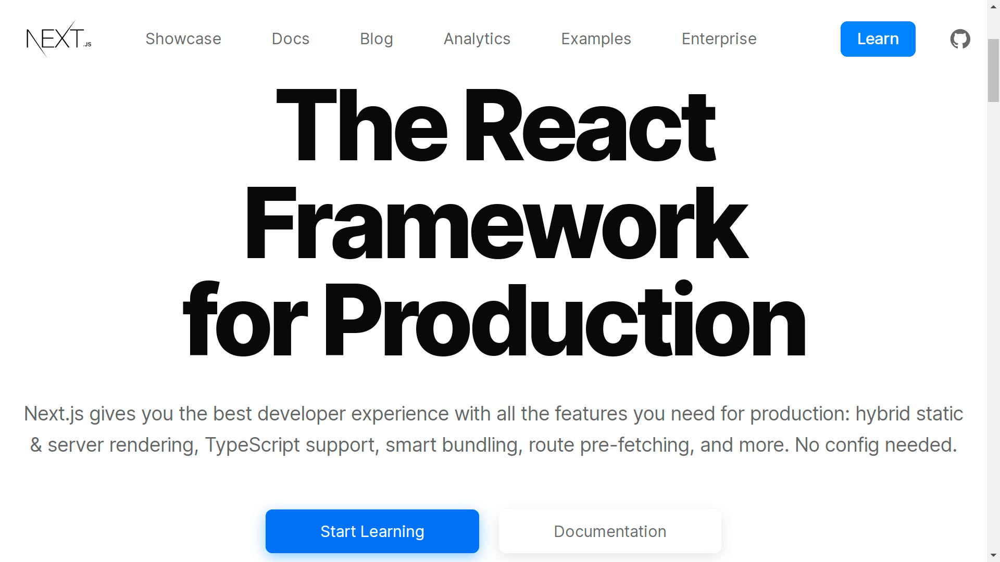
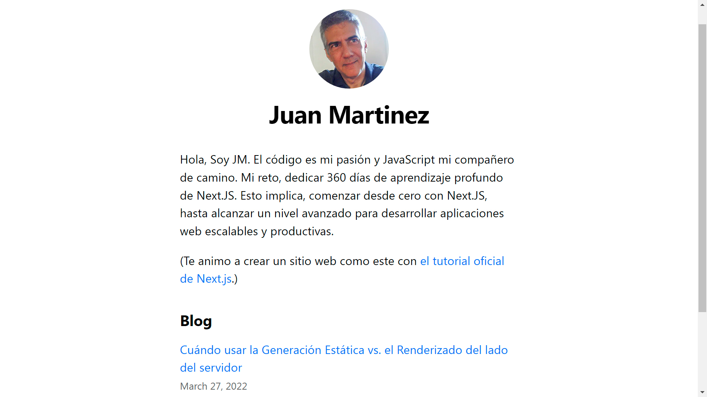
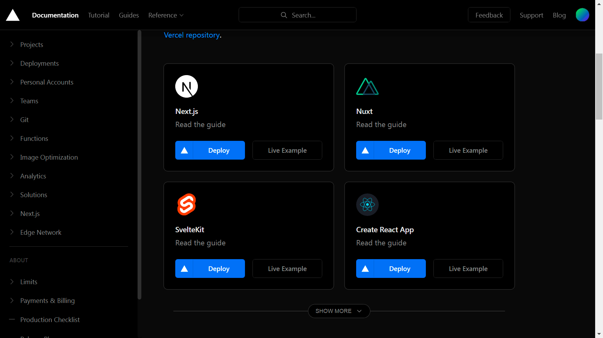

Hola, soy Juan Martinez de Caracas-Venezuela, desarrollador web, con experiencia en sistemas contables y administrativos desde a.I (antes de Internet). Es por ello que **mi reto es reinventarme a mis 54 años y actualizar mis conocimientos en programación en la web**. Y, durante este proceso compartir experiencias y el conocimiento adquirido con todos aquellos amantes de la programación. 

En este sitio vas a encontrar un **curso de Next.js en español para novatos**, donde aprenderás a crear un Blog personal desde cero hasta su implementación en la nube. ¿Qué te parece? ¿Te apuntas?

Este blog se lo dedico a todas aquellas personas que recién se inician en **el camino del desarrollo web**. Ya que todo iniciado, tarde o temprano necesita un mapa con un norte establecido para recorrer la mejor **ruta de aprendizaje** en este mundo digital. Sobre todo si ya has terminado un curso de JavaScript y te preguntas; ¿ahora qué sigue?, ¿dónde aplico estos conocimientos?, ¿cómo creo mi primera aplicación útil y funcional en la web?  

<h2>Next.js el Framework de React.js para Producción</h2>

Aquí vas encontrar información relevante sobre [Next.js](https://nextjs.org/), el cual es un Framework que te va a permitir organizar y desarrollar tu proyecto con todas las funciones que necesitas para finalizar y entregar al mundo tu trabajo en la web. 

Para un desarrollador conocer las bases de `HTML`, `CSS` y `JavaScript` ya no es suficiente; esto es solo el principio. De hecho, conocer esta base es solo el primer gran paso. Y si aún no conoces JavaScript y recién te inicias en este mundo de la programación, entonces no lo pienses mucho, ya que con `JavaScript` estás en buenas manos. 

Pero te advierto, al final del día **vas a necesitar un Framework como Next.JS** para construir aplicaciones escalables y de fácil mantenimiento. La buena noticia es que aquí, en este sitio web, vas a obtener una visión completa del ciclo de vida de un proyecto de desarrollo de software con JavaScript. Un ciclo que inicia con la organización de tu proyecto con un Framework como Next.Js; donde hay un desarrollo, pruebas, visualizaciones, cambios y mejoras al código; hasta llegar a la etapa final donde implementas tu proyecto en la nube. 

<h2>Cómo crear una aplicación con Next.js</h2>

Hoy quiero compartir este [tutorial de Next.js en español para novatos](https://tutorial-nextjs-esp.vercel.app/docs/intro), donde vas a aprender a crear tu Blog personal desde cero hasta su implementación en la nube. 

Este tutorial está inspirado en el curso en inglés de Next.js: **[Create a Next.js App](https://nextjs.org/learn/basics/create-nextjs-app)**. Me tomé la tarea de documentar mi progreso día a día, para ello utilicé [Notion](https://www.notion.so/). Así que tomé apuntes, realicé capturas de pantalla, practiqué y estudié cada tema antes de continuar con el siguiente punto. 

Te lo cuento, ya que de nada vale realizar el curso oficial de Next.js si solo copias y pegas el código y sigues los pasos sin entender que es lo que haces. Así que, con el curso de Next.js logré crear [mi primera aplicación web de un blog personal en la nube](https://nextjs-blog-jalvmart.vercel.app/). 

<h2>¿Por qué elegir Next.JS como Framework para React.JS?</h2>

Hoy en día, cuentas con múltiples herramientas, lenguajes de programación y librerías que elegir con cuál de ellas trabajar es difícil. Por lo tanto, **si te toca elegir, primero aprender HTML, CSS y JavaScript**; esto se convertirá en una de tus mejores decisiones. 

Sin embargo, **el éxito consiste en profundizar en el aprendizaje de JavaScript** para lograr una buena base; ya que todas las herramientas y plataformas con las que luego vas a trabajar, orbitan alrededor de este lenguaje de programación. 

<h2>¿Elige el mejor kit de desarrollo de software?</h2>

Cuando quieres construir una aplicación web completa desde cero, con solo HTML, CSS y JavaScript, pronto descubres que es una tarea dura. **Sin un Kit de Desarrollo de Software vas a escribir código puro y duro en JavaScript con un gasto de descomunal de neuronas**. 

Entonces, no es necesario construir muchas de las funciones que ya existen y se encuentran disponibles como una alternativa en librerías y paquetes de terceros. También, los estilos CCS, el cuál es otro mundo. Incluso, no tienes que batallar con todo el proceso que toma, compilar, empaquetar, minimizar y dividir el código para preparar y entregar el producto final. 

La solución y una buena práctica es contar con un Kit de desarrollo de Software (SDK) que te permita organizar tu desarrollo web para luego implementar tu proyecto de manera eficiente. Esto es lo que te permite **Next.JS, te brinda un entorno de trabajo acorde a tus necesidades**, mientras que **con Vercel podrás implementar cualquier aplicación frontend en su plataforma**. 

Finalmente, me alegró por tomarte un tiempo y leer estás líneas y espero que en este sitio web encuentres la información necesaria para tu crecimiento como desarrollador. Un saludo muy especial desde Caracas-Venezuela.